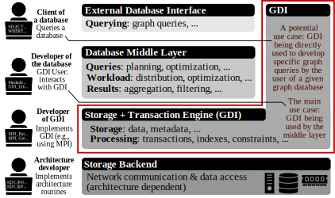

# GDI-RMA (GDA)

<p align="center">
  
</p>

GDI-RMA is a reference implementation of the paper The Graph Database Interface:
Scaling Online Transactional and Analytical Graph Workloads to Hundreds of
Thousands of Cores to be presented at the International Conference for High
Performance Computing, Networking, Storage and Analysis (SC '23).

It implements a distributed-memory graph database with use of one-sided Remote
Direct Memory Access (RDMA). GDI-RMA was scaled to over 7,000 servers with
120,000 cores and 77 TB of distributed memory with datasets scaling up to 34
billion vertices and 549 billion edges.

## Setup Guide

The source code to build the GDI-RMA library can be found in the [src](src)
directory. The library is written in C. Please update the C compiler and its
flags to the needs of your system at the beginning of the
[Makefile](src/Makefile) (variables `CC` and `CFLAGS`). Afterwards calling
`make` should result in the library file `libgdi.a`.

If you intend to use
[foMPI](https://spcl.inf.ethz.ch/Research/Parallel_Programming/foMPI/), please
enable the related parameters in lines 6 to 9 of the Makefile and set the path
to your foMPI installation in line 6.

## Quickstart

The following source code provides a minimal example, that creates a simple
graph database, which contains two vertices that are connected through a
directed edge. Error checking is omitted for clarity.

```C
#include <stdio.h>

#include "gdi.h"

int main( int argc, char* argv[] ) {
  /* initialization */
  MPI_Init( &argc, &argv );
  GDI_Init( &argc, &argv );

  /* graph database creation */
  GDI_Database db;
  GDA_Init_params parameters;
  parameters.block_size = 256;
  parameters.memory_size = 4096;
  parameters.comm = MPI_COMM_WORLD;
  GDI_CreateDatabase( &parameters, sizeof(GDA_Init_params), &db );

  /* start transaction */
  GDI_Transaction transaction;
  GDI_StartTransaction( db, &transaction );

  /* create two vertices */
  GDI_VertexHolder vert1, vert2;
  uint64_t vertex_id = 1;
  GDI_CreateVertex( &vertex_id, 8, transaction, &vert1 );
  vertex_id = 2;
  GDI_CreateVertex( &vertex_id, 8, transaction, &vert2 );

  /* connect vertices with an edge */
  GDI_EdgeHolder edge;
  GDI_CreateEdge( GDI_EDGE_DIRECTED, vert1, vert2, &edge );

  /* commit transaction to the database */
  int status;
  status = GDI_CloseTransaction( &transaction, GDI_TRANSACTION_COMMIT );
  if (status == GDI_SUCCESS ) {
    printf("Transaction successful.\n");
  }

  /* graph database deallocation and clean up */
  GDI_FreeDatabase( &db );
  GDI_Finalize();
  MPI_Finalize();

  return 0;
}
```
Assuming that the source code is stored in the main directory in the file
`min_example.c`, it can be compiled for example with the command `mpicc -o
min_example min_example.c -I src -Lsrc -lgdi` and executed with the command
`mpirun -n <#procs> ./min_example`.

## Documentation

The Graph Database Interface (GDI) API is documented as a
[specification](specification/gdi_v0.1.pdf) and high-level overviews of that
specification can be found in the respective [README](specification/README.md)
as well as in the paper. The paper also presents an overview of the
GDI-RMA implementation of the GDI specification.

## Citations

Any published work which uses this software should include the following
citation:

```bibtex
@inproceedings{besta2023graph,
  author = {Besta, Maciej and Gerstenberger, Robert and Fischer, Marc and Podstawski, Michal and Blach, Nils and Egeli, Berke and Mitenkov, Georgy and Chlapek, Wojciech and Michalewicz, Marek and Niewiadomski, Hubert and Mueller, Juergen and Hoefler, Torsten},
  title = {The Graph Database Interface: Scaling Online Transactional and Analytical Graph Workloads to Hundreds of Thousands of Cores},
  year = {2023},
  isbn = {9798400701092},
  publisher = {Association for Computing Machinery},
  address = {New York, NY, USA},
  url = {https://doi.org/10.1145/3581784.3607068},
  doi = {10.1145/3581784.3607068},
  booktitle = {Proceedings of the International Conference for High Performance Computing, Networking, Storage and Analysis},
  articleno = {22},
  numpages = {18},
  location = {Denver, CO, USA},
  series = {SC '23}
}
```
