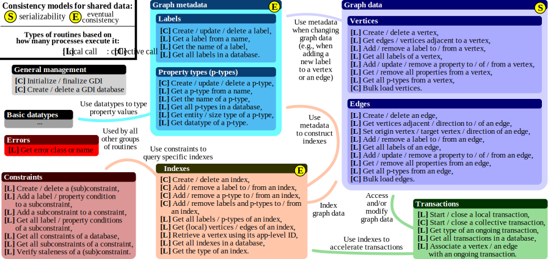

# Graph Database Interface (GDI)

  

This directory constains the specification of the Graph Database Interface
(GDI).

## Goals

GDI is a key ingredient in an effort to solve four key challenges of graph
databases: high performance, scalability, programmability, and portability.

GDI is a storage engine layer interface for distributed graph databases. As
such, its main purpose is to abstract the low-level storage layer such that
higher-level parts (query methods, query planners, execution engines, and
others) of the graph database can run vendor agnostic. This also allows to
distribute the graph over a network to multiple storage backends (multiple
machines) which might rely on main-memory, hard disks, SSDs, and others. The
interface provides a short list of methods offering CRUD (create, read, update,
delete) functionality for common graph data concepts, including edges, vertices,
properties, and labels. The focus lies on methods with clear semantics such that
high-performance implementations are possible that scale to thousands of cores.
Simultaneously, the provided semantics are rich and support different graph
database features such as ACID transaction handling.

## Context

GDI acts as storage engine interface for a distributed graph database. As such,
it is the task of GDI to ensure data consistency, transactional data access, low
response times and high throughput. If the data is distributed among multiple
machines, implementations must consider the CAP-theorem and explicitly state
which properties (consistency, availability, partition tolerance) they offer.
Note that due to the ACID guarantee of GDI, implementations must offer
consistency. This also implies that data might be stored redundant such that
fault tolerance is taken into account.

The following table illustrates an example design of a graph database. GDI acts
as an API that can be used by any of the higher layers.

| (Layer 6) Client |
| A client queries the graph database. Typically, the client uses a graph query language to run traversals and graph matching requests. |
| (Layer 5) Query Planner |
| The query planner works in close cooperation with the execution engine to determine an ordered set of steps to execute the query given by the client. |
| (Layer 4) Execution Engine |
| Execution engine distributes workload among multiple machines and aggregate intermediate results that ran on different processes. |
| (Layer 3) Query Functions |
| Query functions consume data from the storage engine and return objects like edges, vertices, paths, or subgraphs. Aggregation functions are provided to return aggregated values. Further functionality includes filtering of objects (e.g., by labels or properties). |
| **(Layer 2) Storage Engine (GDI)** |
| Storage engine uses the low-level storage layer to access the graph data. It basically translates from disk dependent storage (for example CSV, JSON, binary format, block format) to generic objects. Therefore, this layer provides a rich set of interfaces to create, read, update and delete (CRUD) vertices, edges and associated labels and properties. This layer should provide ACID guarantees to the upper layers. If not, then a layer above must handle queries in a way that they do not interfere. |
| (Layer 1) Low-Level Storage Layer (Storage Backend) |
| This layer provides an abstraction for a low-level storage layer such as hard disks (for example CSV files, JSON, binary formats, block format), RAM, distributed RAM or others. Its goal is to store the data in a reliable way and provide fast data access. |

## Execution and Consistency

GDI is constructed with distributed graph databases in mind, but it can also be
used for single-node or single-core databases. Generally, it is assumed that a
set of independent processes run concurrently in a (tightly coupled) compute
cluster. GDI offers no general functionality to the user to manage the processes
as it might be required in a primary-secondary model or a full-fledged graph
database. Instead, it is the responsibility of the user to distribute and assign
work to the processes in the appropriate way.

GDI uses different consistency models. GDI guarantees serializability for graph
data, such as vertices, edges and associated labels and properties. Generally,
this data can only be altered by transactions that ensure ACID properties
(atomicity, consistency, isolation, durability). Further, GDI guarantees
eventual consistency for global elements, such as labels, property types and
indexes. Since these objects also affect the graph data, this might lead to
cases where graph data becomes inconsistent until the system has converged.
Transactions must be able to detect such state and abort accordingly. GDI
provides barrier functions to the user to synchronize the system. Some GDI
functions provide explicit synchronization, which is generally described in more
detail in the function’s specification. Note that implementations might provide
consistency models for global elements that are more restrictive (stronger) than
eventual consistency.

## Following Established and Time-Tested Specifications

In GDI, we follow the practice and style of the Message Passing Interface (MPI),
an established API that provides a specification of a communication library for
computing clusters. Our main motivation is the fact that the goals of MPI are
very similar to those of GDI, i.e., MPI was designed to enable portability,
programmability, scalability, and high performance.

## Low-Level of Specification

In GDI, we follow MPI and use an analogous "low-level" style of the interface
specification, that is similar to C. This fosters portability across different
architectures. However, there is nothing that prevents potential GDI
implementations from adapting an object-oriented style, as long as they adhere
to the GDI semantics. In fact, MPI implementations such as MPICH also provide
"object style" APIs to their communication functions.
